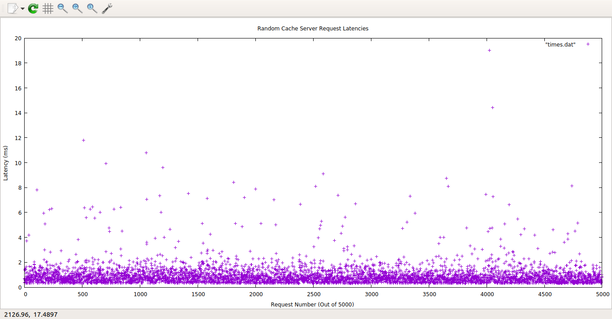
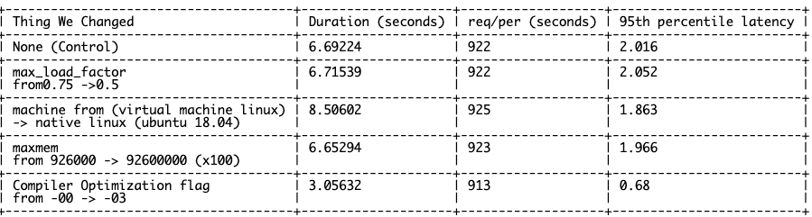

# HW5: Lies, statistics, and benchmarks
Arthur Lawson, Ian Jackson

## Part 1:

Adhering to the ratios observed in the Memcached workload paper, our implementation created "common keys", which populated 50% of the total key pool and were accessed with a probability of 99% and "rare keys," which took up the other 50% of the total key pool and were accessed with a probability of 1%.

### Warm Cache Implementation
We originally called warm_cache inside of generate, but moved it into baselines.cc to make sure that it was only called once and didn't delay the overall time of testing.
We started each workload with a ready-warm cache, which was filled with # keys = n_requests / 3, to make sure that we had enough keys to handle the ratio of delete requests to set requests. This prevented the key pools from becoming completely emptied by delete requests.

### Testing Parameters:

84% Hit Rate Achieved with 926000 bytes cache memory, 5000 requests

## Part 2:

We tested the baselines by inputting the parameters that gave us 84% hit rate in Part 1 (926000 bytes cache memory, 5000 requests), and found a 95% percentile of 1.94ms and a rate of 914 requests/second.

The array of latencies for each request was ofstreamed into a file, "times.dat," and gnuplotted as a scatter plot, the output of which was saved as latency_plot.png (below).

The latencies here are generally uniform across request number and requets type, with a few outliers. The 95% percentile of 1.94 argues further that a significant percentage of the distribution has latencies faster than the visible outliers.

## Part 3:

These are the things that we altered in order to analyze the effects they have on performance:

***Measure baseline performance (req/sec & 95th % (ms)) 
***Measure total time for all operations (total time of baseline latencies)
***Change maxmemory
***Change machine

These changes have been recorded in the table below.

Control:

The control test ran on a mac -> ubuntu virtual machine with compiler optimization -00, max_load_factor 0.75, maxmem:926000.

Load_factor:
This change was relatively minimal compared to the control group with very similar numbers across the board. The timing metrics were a bit slower, however. We attribute this to an increase in cache growth once the lower threshhold had been reached.

Machine:

Surprisingly, there was not that large of a performance gap between the native performance for virtual machine vs native ubuntu. The only noticable gap in performance was the increase duration time which we attribute to the lower RAM capabilities (as we compared from our HW1 Benchmark tests).

maxmem:

Maxmem did not have the performance benefits that we anticipated, with similar numbers across the board. One reason we believe is that once you have reached a certain cache size, there is a plateau for performance. We do believe that our chosen maxmem is at the beginning of that plateau. In this process, we did discover some bugs related to smaller cache sizes. It did not seem to be consistent (maxmem ~100 worked ok), but when we stumbled on some smaller values we encountered a floating point value error that we did not have much time to explore. We did, however, use this as an opportunity to debug an evictor issue from HW4.

Compiler:

The new optimization created performance benefits in both duration and a much lower mean latency. This requires the least analysis because we are all aware of the magic the compiler can do when we give it the space to shine! The thing of note is that req/per did not change much.

## Bugs, Leaks, and Warnings
Sometimes, if maxmem is too big a number, running the server leads to an error. This could be due to the fact that Cache::size_type is a u_int32 and cannot take numbers over 4294967294. As we progressed, we fixed this so we could go up to the unint32 limit and discovered some issues with a smaller cache size as mentioned above (part 3->maxmem)

## Contributions / Sources
Design adopted from assigned Memcache Readings (Nishtala et al. 2013, Atikoglu et al., 2012).
